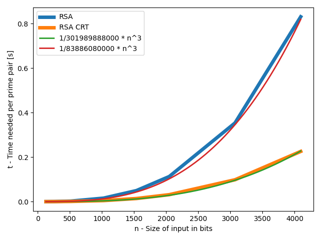

## Zadanie Domowe 5
Celem zadania było napisanie generatora liczb pierwszych, a następnie porównanie ze sobą prędkości działania RSA z CRT jak i RSA bez CRT
### Generowanie liczb pierwszych
N-bitową liczbę pierwszą generujemy w następujący sposób
```
While True:
    Wylosuj n-bitową liczbę p
    jeżeli dzieli się przez małe liczby pierwsze:
        jeżeli przechodzi test millera rabina 20 razy:
            zwróc p
```
Używając 
```bash
python3 generuj_pierwsze.py amount_of_bits
```
wygenerujemy 50 liczb pierwszych o wielkości *amount_of_bits*, zapisanych do pliku primes_data/p_*amount_of_bits*.txt

### Obliczanie RSA i CRT
Po wygenerowaniu liczb pierwszych by zebrać dane na temat tego ile czasu wykonujemy RSA i RSA_CRT możemy użyć
```bash
python3 simulation.py
```
Testy są prowadzone na próbie 1000 par p, q pobieranych z każdego pliku w *primes_data*.  
Pary są dobierane losowo, a następnie wykonywany jest RSA i RSA_CRT

### Wykres
efekty symulacji możemy zobaczyć wpisujac w konsoli
```bash
python3 visualise.py
```
lub
```bash
python3 visualise.py --additional
```

*Efekt po wpisaniu python3 visualise.py --additional*
