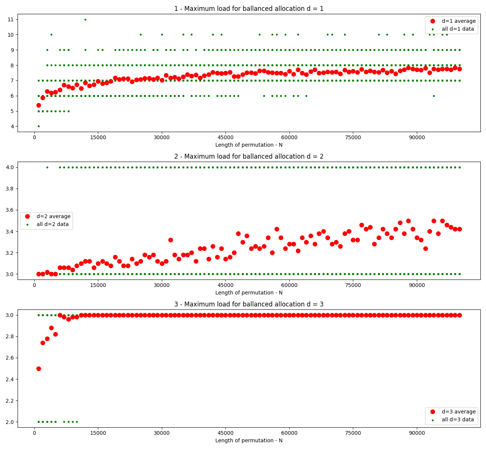

1. Random number generator used in simulations is "good"  
As specified in exercise, Mersenne Twister is a good RNG
and as specified in [python docs](https://docs.python.org/3/library/random.html)    
Python random library uses such one as it's core generator
2. As we can see on the plot, the higher d value the more balanced plot is.  
We see that for d=3 maximum load is equal to 3 but also we know that for d >= n   
maximum load is equal to 1 always.  
Nonetheless I hypothetise that average for n maximum load function of d variable is decreasing

