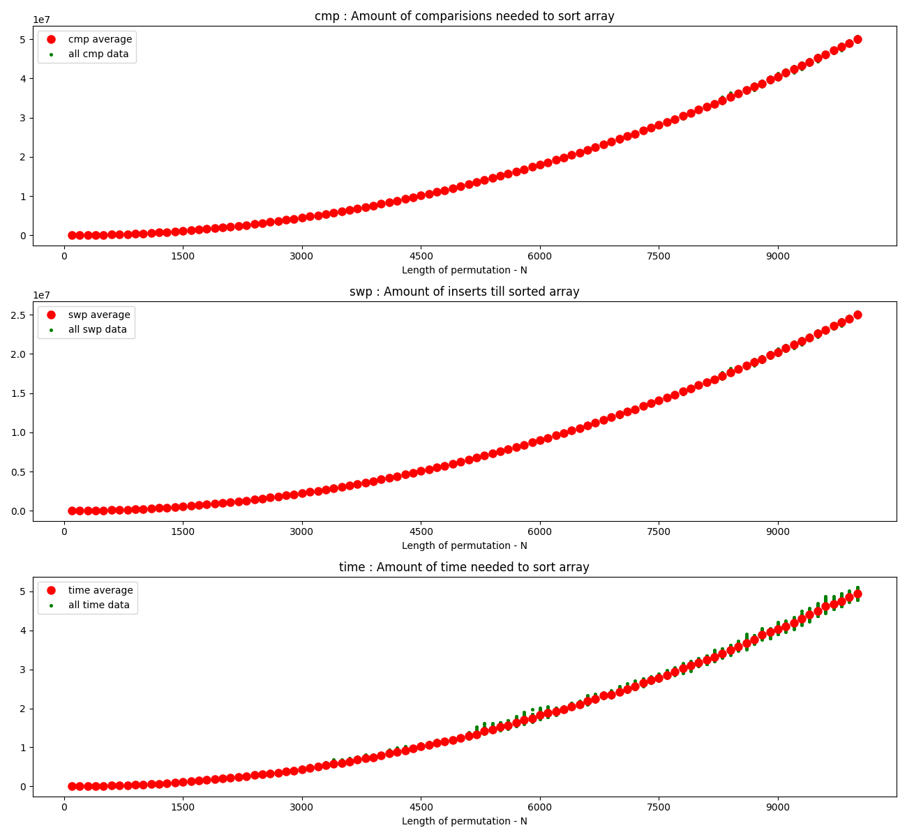
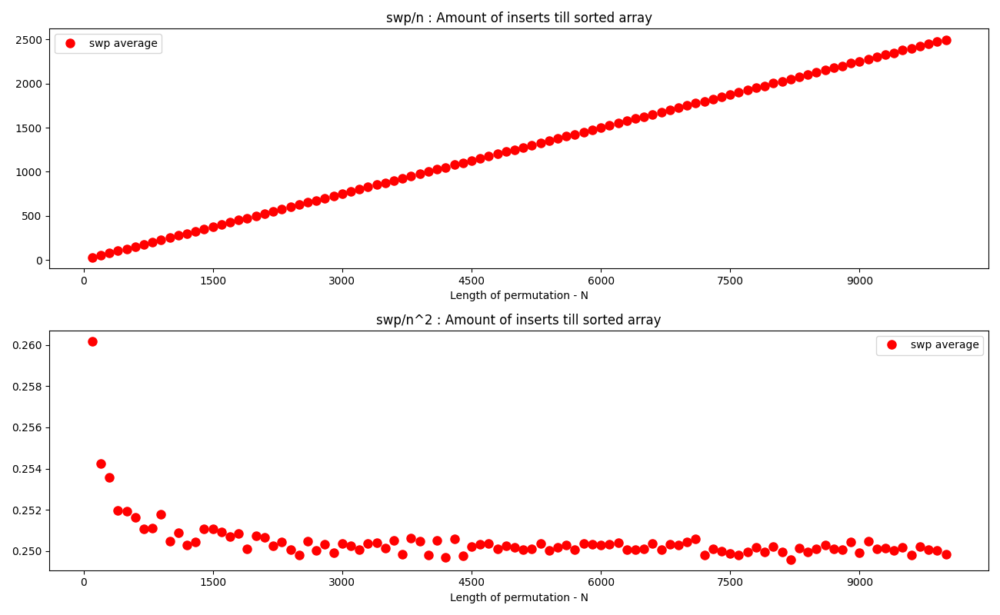
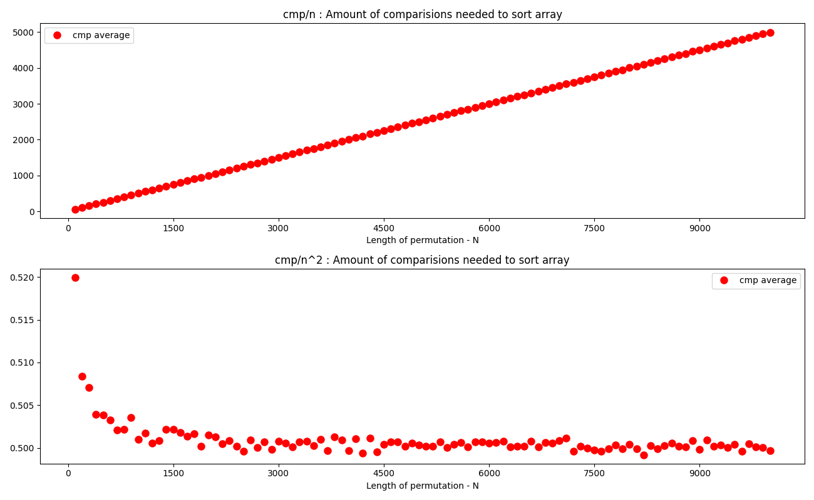

1. Random number generator used in simulations is "good"  
As specified in exercise, Mersenne Twister is a good RNG
and as specified in [python docs](https://docs.python.org/3/library/random.html)    
Python random library uses such one as it's core generator
2. By looking at the plot below we can hypothetise that all functions are O(n^2).  
We will look at it closer on next graphs
  
3. As we see on plot below swp is a function O(n^2) and I can even guess that for n -> inft swp(n) = 1/4*n^2

4. As we can see on plot below is a function O(n^2) and I can even guess that for n-> inft cmp(n) = 1/2*n^2
