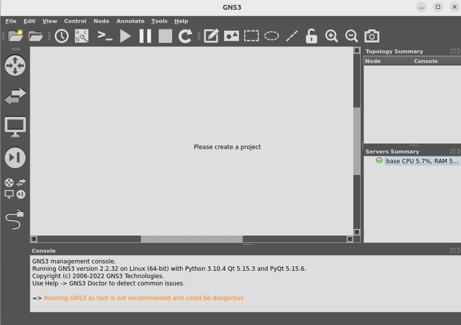
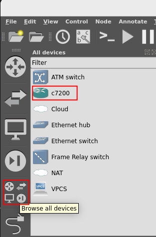
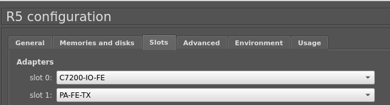
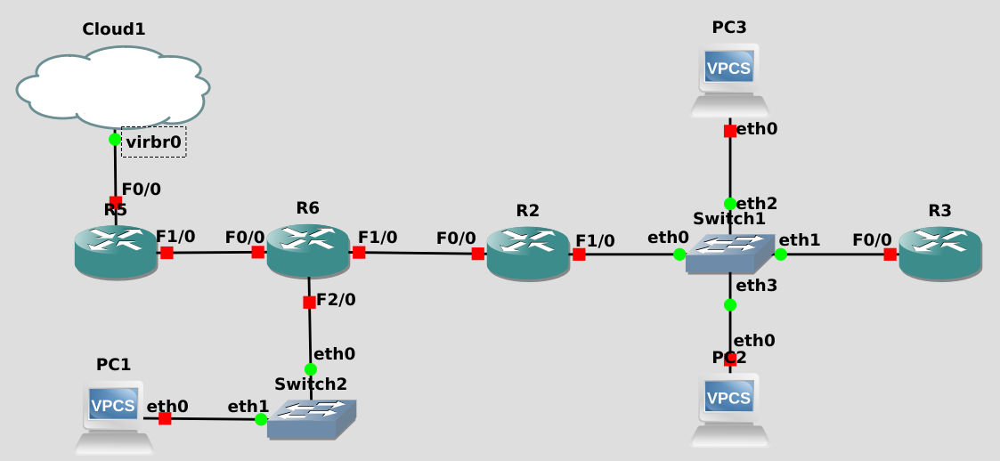
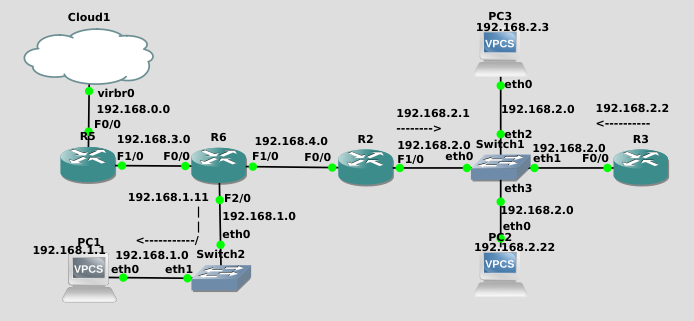
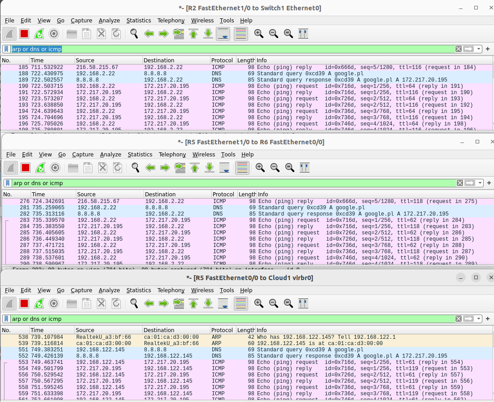

## Task description
1. In GNS3 simulation program create a virtual network with a given topology such that:
   
   1. the virtual network is connected with the outside „physical” network represented by device named `Cloud`.
   2. `R5` has a dynamic IP address given by `Cloud`
   3. other devices have their static IP address inside their local networks
   4. all devices are able to communicate with each other via `ping`
   5. all devices are able to communicate with the outside world e.g. `google.com`
2. Setup packet capture on networks `192.168.0.0.`, `192.168.2.0`, `192.168.3.0`.
3. Analyse captured packets sent and received due to executing `ping google.com` in the terminal of PC2.

## Setup
1. Download `c7200` router from [here](https://yaser-rahmati.gitbook.io/gns3/cisco-ios-images-for-dynamips)
2. Download `gns3` by running commands  [here](https://yaser-rahmati.gitbook.io/gns3/linux-installation). If on windows then go [here](https://yaser-rahmati.gitbook.io/gns3/chapter1)
3. Run by typing in terminal `gns3` when on Linux. I had problems with permissions so I am running with `sudo gns3`.
    
4. Add cisco router to gns3 by following [this tutorial](https://www.computernetworkingnotes.com/ccna-study-guide/how-to-add-install-or-import-ios-in-gns3.html).  
    As a result you should see  
    
5. Create your project and start moving needed boxes from `all devices panel` to create photo like from task description.  
    
6. Now time to add links. To do this click `add a link` button on the left panel and connect two objects. They need to have got open ethernet hub. If they lack one then click on the router and add slots like this.
    
Configuring cloud slots may be different for everyone. I am connected to ethernet and it for me it was to
    1. Click on cloud
    2. Show special Ethernet Interfaces
    3. On the bar choose virb0 and click Add 
Result 
7. Config devices by double clicking on one. Console should show up.

## Devices configuration
After every configuration, you can check if router is connected to outside world by typing
```bash
ping google.pl
```
### `R5`
```bash
conf t
int f0/0
ip address dhcp
ip nat outside
no shut
end

conf t
ip domain-lookup
ip name-server 8.8.8.8
end

conf t
int f1/0
ip add 192.168.3.6 255.255.255.0
ip nat inside
no shut
end

conf t
router rip
version 2
no auto-summary
network 192.168.42.0
network 192.168.3.0
default-information originate
end

conf t
access-list 10 permit 192.168.1.0 0.0.254.255
access-list 10 permit 192.168.2.0 0.0.253.255
access-list 10 permit 192.168.3.0 0.0.252.255
access-list 10 permit 192.168.4.0 0.0.251.255

ip nat inside source list 10 interface f0/0 overload
end

wr
```
### `R6`

```
conf t
int f0/0
no shut
ip add 192.168.3.5 255.255.255.0
end

conf t
ip domain-lookup source-interface f0/0
ip name-server 8.8.8.8
end

conf t
int f1/0
no shut
ip add 192.168.4.2 255.255.255.0
end

conf t
int f2/0
no shut
ip add 192.168.1.11 255.255.255.0
end

conf t
router rip
version 2
no auto-summary
network 192.168.1.0
network 192.168.4.0
network 192.168.3.0
end

wr
```

### `R2`

```
conf t
int f1/0
ip add 192.168.2.1 255.255.255.0
no shut
int f0/0
ip add 192.168.4.6 255.255.255.0
no shut
end

conf t
router rip
version 2
no auto-summary
network 192.168.2.0
network 192.168.4.0
end

conf t
ip domain-lookup
ip name-server 8.8.8.8
end
```

### `R3`

```
conf t
int f0/0
ip add 192.168.2.2 255.255.255.0
no shut
end

conf t
router rip
version 2
no auto-summary
network 192.168.2.0
end

conf t
ip domain-lookup
ip name-server 192.168.42.129
end
wr
```

### `PC-1`

```
ip 192.168.1.1/24 192.168.1.11
ip dns 8.8.8.8
wr
```
You can test if connected to web
```
ping google.pl
google.pl resolved to ...

84 bytes from ...
84 bytes from ...
84 bytes from ...
84 bytes from ...
84 bytes from ...
```

### `PC-2`

```
ip 192.168.2.22/24 192.168.2.1
ip dns 8.8.8.8
wr
```

### `PC-3`

```
ip 192.168.2.3/24 192.168.2.1
ip dns 8.8.8.8
wr
```
Configuration after looks like this  

## Follow up tests
Now you can also ping from any device other device like  
while being on PC1 I can ping PC3 with IP 192.168.2.3
```
PC1> ping 192.168.2.3

84 bytes from 192.168.2.3 icmp_seq=1 ttl=62 time=29.495 ms
84 bytes from 192.168.2.3 icmp_seq=2 ttl=62 time=24.677 ms
^C
```
## Listening to communicates
You can start capture communicates by `PPM` link and `Start Capture`

By listening to 192.168.0.0, 192.168.3.0 and 192.168.2.0 and pinging google.pl by PC2(192.168.2.22) we can see that ping creates messages on all ports sent by protocols `ARP` `DNS` `ICMP`


### Conclusion
- After pinging to google.pl, ping goes to every router on the way in simulation.  
We can see this by changing ttl. Closer to PC-2 it is the highest

- Router connected to cloud receives ARP message asking who is 192.168.122.145 to set MAC address

- Then routers send information about address of google.pl by DNS protocol

- Then ping messages occur.