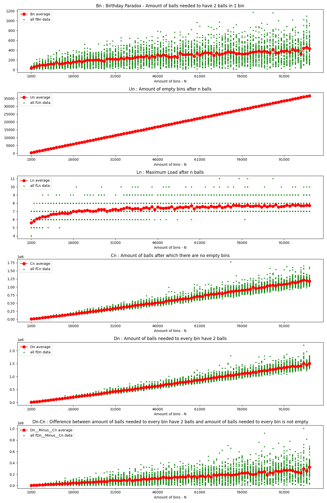
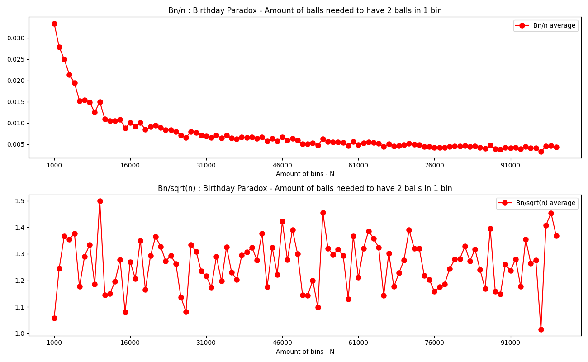
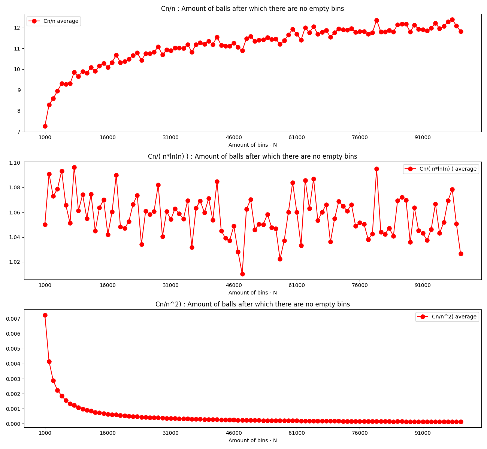
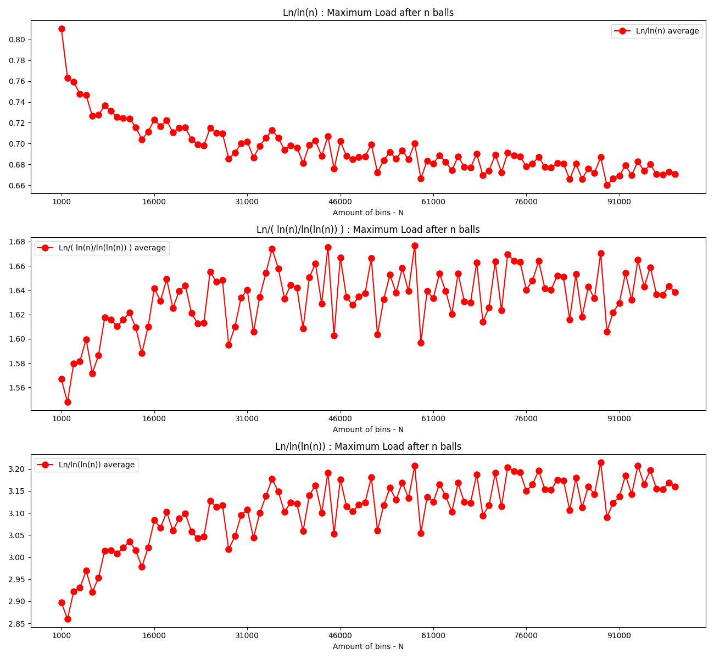
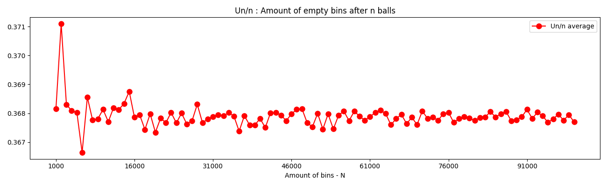
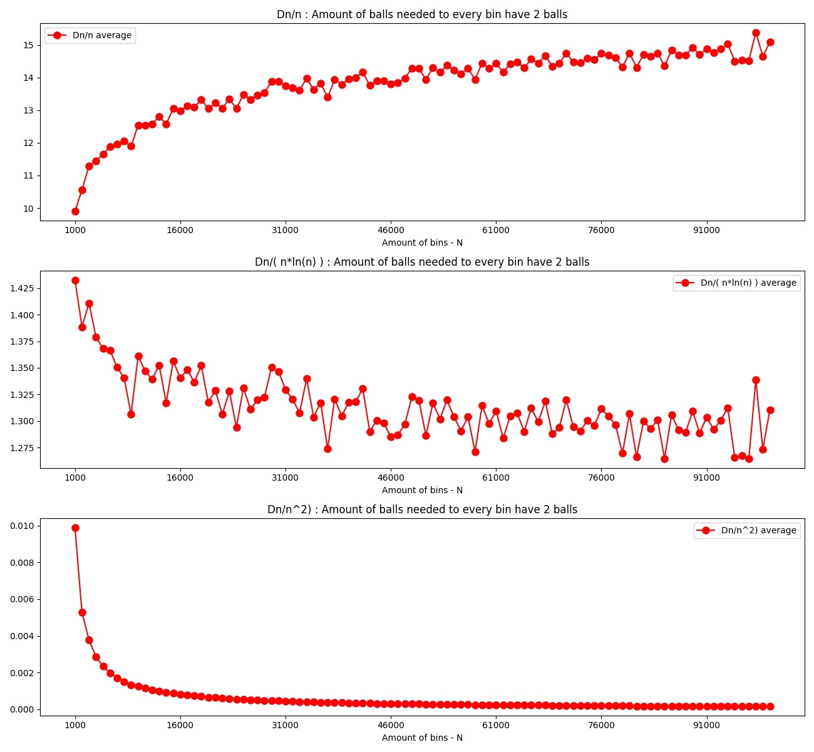
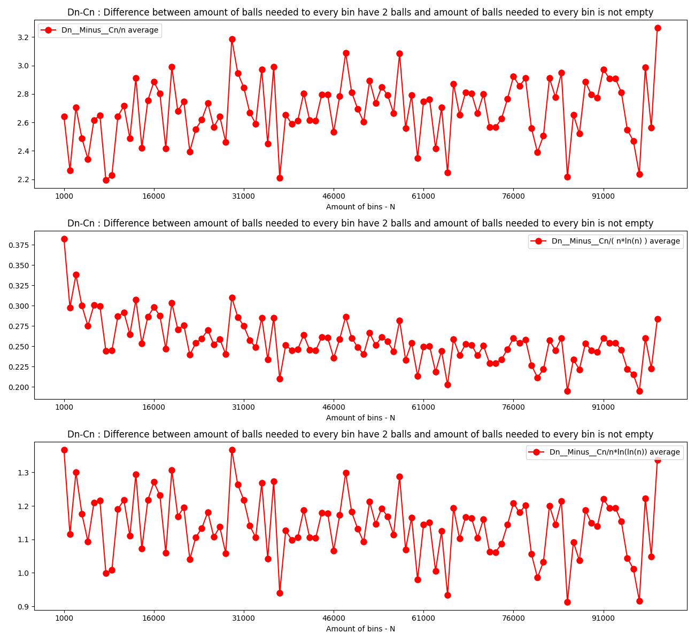

1. Random number generator used in simulations is "good"  
As specified in exercise, Mersenne Twister is a good RNG
and as specified in [python docs](https://docs.python.org/3/library/random.html)    
Python random library uses such one as it's core generator
2. Let's look at functions Bn, Un, Ln, Cn, and Dn.  
Notice that there is no logarithmic scale, but Y axis is scaled to show all values  
By looking at them we can have assumptions that:
   - Bn ~~ O(sqrt(n))
   - Un ~~ O(n)
   - Ln on the beginning looks like O(sqrt(n)) but later on it finds it reaches it's limit at 8. It may be also O(ln(n))
   - Cn ~~ O(n)
   - Dn ~~ O(n)
   - Dn-Cn ~~ O(n)

3. By looking at plot below Bn/sqrt(n) we simply see that Bn ~ O(sqrt(n))

4. By looking at plot below Cn/(n*ln(n)) we simply see that Cn ~ O(Cn)

5. By looking at plot below we more or less see that Ln ~ O(ln(n)/ln(ln(n)))

6. By looking at plot below we see that Un ~ O(n)

7. By looking at plot below we see that Dn ~ O(n*ln(n))

8. By looking at plot below we see that Dn__Minus__Cn ~ O(n*ln(ln(n)))

